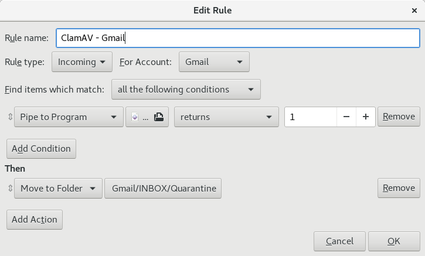
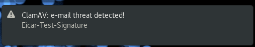

# evolution-mail-filter-clamav

External e-mail filter for [Evolution](https://help.gnome.org/users/evolution/stable/) mail client that scans messages for viruses using [ClamAV](https://www.clamav.net/) anti-virus.

## Prerequisites

This filter was written in [BASH](https://www.gnu.org/software/bash/) and [AWK](https://www.gnu.org/software/gawk/), which should come pre-installed on most Linux distributions. It depends on ClamAV (`clamscan`) and [Gnome's libnotify](https://gnome.pages.gitlab.gnome.org/libnotify/) (`notify-send`).

It was successfully tested on:
1. [Ubuntu](https://ubuntu.com/desktop) 22.04.4 LTS (jammy) running Evolution 3.44.4, GNU BASH 5.1.16, MAWK 1.3.4, ClamAV 0.103.11  and libnotify 0.7.9.
2. [Fedora](https://getfedora.org/) 28 Workstation running Evolution 3.28.5, GNU BASH 4.4.23, GNU AWK 4.2.1, ClamAV 0.100.1 and libnotify 0.7.7.

For other Linux distributions you might want to adjust the the path to the `dialog-warning-symbolic.svg` file inside the shell script, because it can be different. Instructions on how to install ClamAV can be found [here](https://docs.clamav.net/manual/Installing.html).

## Installing

Note: the brief instructions below assume the reader has some basic knowledge of how to use a Linux system.

Simply copy **both** scripts from this project (`.sh` and `.awk`) into a directory of your choice (suggestion: `${HOME}/bin`), set the execute permission on the `.sh` script (e.g. `chmod u+x clamav_evolution.sh`), and add a new message filter for incoming mail to Evolution which pipes messages to the `.sh` script (see [here](https://help.gnome.org/users/evolution/stable/mail-filters.html.en) for more information):



You might want to create a new subfolder under your INBOX to where the messages caught by this filter would be moved (suggestion: Quarantine).

## Testing

You can use [EICAR's standard anti-virus test files](https://www.eicar.org/download-anti-malware-testfile/) to see if the script works. For instance:

```
$ cat eicar.com | clamav_evolution.sh
```

You should see a desktop notification like the one below:



## Usage

After enabling the new message filter in Evolution, every new email that arrives at your INBOX will be automatically sent to the shell script, which in turn will send it to ClamAV. If ClamAV finds a threat then the script will send you a desktop notification.

In fact, the shell script only acts as liaison between Evolution and ClamAV. The AWK script is just for parsing the email message and extract the fields `From` and `Subject` to enrich the desktop notification so it's easier to identify which message contains the threat.

## Tweaks

There are a few things that you might want to change in the shell script depending on how many emails you receive or how dramatic you want the threat notification to be. See below:

* **Recommended!** You might want to use `clamdscan` instead of `clamscan` if you receive many emails, because it is **a lot** faster, but it consumes a bit more RAM (~1GB) and requires some configuration.
* More visible threat notifications can be achieved by replacing `notify-send` with [`zenity`](https://gitlab.gnome.org/GNOME/zenity) (Gnome) or [`kdialog`](https://invent.kde.org/utilities/kdialog) (KDE).

## Limitations

Currently the script can't decode "encoded-words" if they are used in email headers, therefore any notifications triggered by emails that contain those "encoded-words" (e.g. in the subject line) will display their encoded form. Note that the virus detection works as usual and it's not affected by this limitation.

Please refer to [RFC1522](https://tools.ietf.org/html/rfc1522) for more information.

## Alternatives

ClamAV now has [on-access scanning](https://docs.clamav.net/manual/OnAccess.html) capabilities which might be interesting to explore if you are tech savvy, but note that [there was some criticism about its stability](https://wiki.archlinux.org/title/ClamAV#OnAccessScan). I personally haven't tested it.

## License

This project is licensed under the MIT License - see the [LICENSE](LICENSE) file for details.

